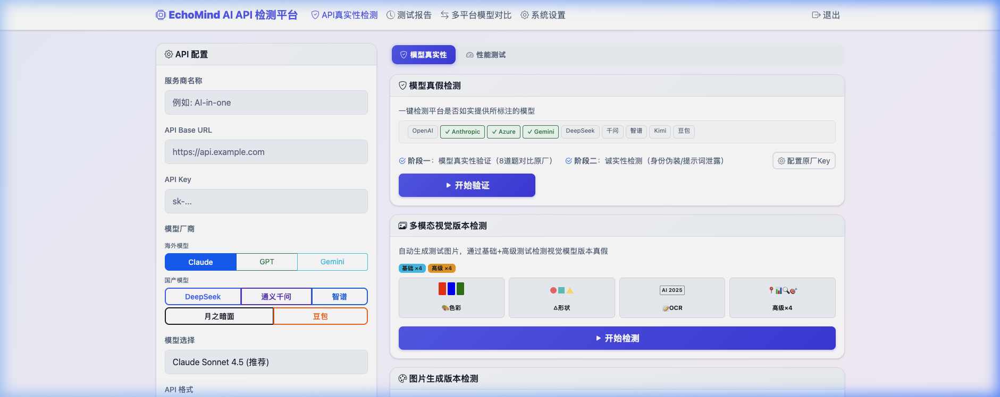
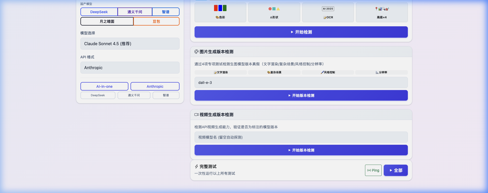

# EchoMind AI API 检测平台

<p align="center">
  <strong>一键检测 AI API 服务商是否如实提供所标注的模型</strong>
</p>

<p align="center">
  
  
  
  
</p>

---

当你通过第三方 API 平台使用 Claude、GPT、Gemini 等模型时，如何确定对方提供的是**真正的原厂模型**，而不是用低成本模型"套壳"冒充？

**EchoMind AI API 检测平台** 帮你一键验证，通过向待测 API 和原厂 API 发送相同请求、对比响应相似度，科学判断模型真实性。



## ✨ 核心功能

### 🔍 模型真假检测
- **真实性验证** — 8道专业题对比原厂API响应，判断是否"套壳"
- **诚实性检测** — 身份伪装测试 + 提示词泄露检测，验证模型行为一致性
- **自动连续执行** — 两阶段自动串联，一键完成全部检测

### 🎨 多模态视觉版本检测
- **图片生成版本检测** — 通过 4 项专业测试（文字渲染、复杂场景、风格控制、分辨率），评估图像生成模型的实际版本
- **视频生成版本检测** — 探测 API 端点、检查规格参数、测试复杂提示词能力

### 📊 多模型横向对比
- 多个模型同时回答相同问题
- 并排展示响应内容、速度、Token 用量
- 支持代码生成、逻辑推理等多种测试维度

### ⚡ 性能测试
- 并发能力测试
- 响应速度（TTFT / TPS）
- 大 Token 处理能力
- Token 用量统计与费用预估

### 📋 测试报告
- 自动保存历史记录
- 完整测试报告下载
- AI 智能分析总结

## 🖥️ 界面预览



## 🚀 快速开始

### 方式一：一键启动（推荐）

```bash
git clone https://github.com/huyang218/AiApiTest.git
cd AiApiTest
chmod +x start.sh
./start.sh
```

脚本会自动创建虚拟环境、安装依赖并启动应用。

### 方式二：手动安装

```bash
# 克隆项目
git clone https://github.com/huyang218/AiApiTest.git
cd AiApiTest

# 创建虚拟环境
python3 -m venv venv
source venv/bin/activate

# 安装依赖
pip install -r requirements.txt

# 启动应用
python app.py
```

### 方式三：Docker 部署

```bash
# 构建镜像
docker build -t echomind-api-check .

# 运行容器
docker run -d -p 5001:5001 -v ./settings.json:/app/settings.json echomind-api-check
```

### 访问平台

启动后访问：

- 本地：http://localhost:5001
- 远程：http://服务器IP:5001

> **默认登录密钥**：`admin123`（可在设置页面修改）

## ⚙️ 配置原厂 Key

在「系统设置」页面配置原厂 API Key，作为模型真假对比的"标准答案"：

### 海外模型

| 厂商 | 支持模型 | 获取 Key |
|------|----------|----------|
| **OpenAI** | GPT-4o, GPT-4 Turbo, GPT-4, GPT-3.5 | [platform.openai.com](https://platform.openai.com) |
| **Anthropic** | Claude 4.5 Sonnet/Opus, Claude 4, 3.5 系列 | [console.anthropic.com](https://console.anthropic.com) |
| **Azure OpenAI** | GPT-4o, GPT-4 Turbo, GPT-4 | [portal.azure.com](https://portal.azure.com) |
| **Gemini** | Gemini 2.0 Flash, 1.5 Pro, 1.5 Flash | [aistudio.google.com](https://aistudio.google.com) |

### 国产模型

| 厂商 | 支持模型 | 获取 Key |
|------|----------|----------|
| **DeepSeek** | DeepSeek-V3, DeepSeek-R1 | [platform.deepseek.com](https://platform.deepseek.com) |
| **通义千问** | Qwen-Max, Qwen-Plus, Qwen-Turbo | [dashscope.aliyun.com](https://dashscope.aliyun.com) |
| **智谱 GLM** | GLM-4, GLM-4-Flash | [open.bigmodel.cn](https://open.bigmodel.cn) |
| **月之暗面** | Kimi (Moonshot-v1) | [platform.moonshot.cn](https://platform.moonshot.cn) |
| **豆包** | Doubao-Pro, Doubao-Lite | [console.volcengine.com](https://console.volcengine.com) |

你也可以直接编辑 `settings.json` 文件（参考 `settings.example.json`）。

## 🔧 模型名称映射

第三方平台常使用非标准模型名，例如 `claude-4.5-sonnet` 而非原厂的 `claude-sonnet-4-5-20250929`。

在设置页面配置「模型名称映射」，系统会自动将第三方名称映射到原厂名称进行验证：

```
claude-4.5-sonnet → claude-sonnet-4-5-20250929
gpt-4o            → gpt-4o-2024-08-06
```

## 📁 项目结构

```
AiApiTest/
├── app.py                  # Flask 应用入口
├── api_tester.py           # API 测试核心库
├── config.py               # 应用配置
├── requirements.txt        # Python 依赖
├── settings.example.json   # 配置文件模板
├── start.sh                # 一键启动脚本
├── stop.sh                 # 停止脚本
│
├── core/                   # 核心模块
│   ├── database.py         # SQLite 数据库管理
│   ├── settings_manager.py # 配置读写
│   └── utils.py            # 工具函数（API 调用封装）
│
├── routes/                 # 路由模块
│   ├── auth.py             # 登录认证
│   ├── pages.py            # 页面路由 + 设置 API
│   ├── records.py          # 历史记录管理
│   └── test_text.py        # 测试接口（真假检测、对比等）
│
├── testers/                # 测试器
│   └── text_tester.py      # 文本模型测试逻辑
│
├── templates/              # Jinja2 HTML 模板
│   ├── base.html           # 基础布局
│   ├── login.html          # 登录页
│   ├── index.html          # 测试主页
│   ├── compare.html        # 多模型对比
│   ├── history.html        # 历史记录
│   ├── record_detail.html  # 测试详情
│   └── settings.html       # 系统设置
│
├── static/                 # 静态资源
│   └── css/style.css       # 自定义样式
│
└── docs/                   # 文档资源
    └── screenshot_*.png    # 截图
```

## 🔒 安全说明

- 待测 API Key **不会保存**到数据库或磁盘
- 原厂 Key 存储在本地 `settings.json`，已加入 `.gitignore`
- 支持自定义登录密钥
- 所有数据存储在本地 SQLite，不外传

## 📱 响应式设计

支持桌面端和移动端访问，自适应布局。

## 🤝 贡献

欢迎提交 Issue 和 Pull Request！

1. Fork 本项目
2. 创建特性分支 (`git checkout -b feature/amazing-feature`)
3. 提交更改 (`git commit -m 'Add amazing feature'`)
4. 推送分支 (`git push origin feature/amazing-feature`)
5. 提交 Pull Request

## 📄 License

本项目采用 [MIT License](LICENSE) 开源。

## 🙏 致谢

- [Flask](https://flask.palletsprojects.com/) — Web 框架
- [Bootstrap 5](https://getbootstrap.com/) — UI 组件
- [Bootstrap Icons](https://icons.getbootstrap.com/) — 图标库

---

<p align="center">
  Made with ❤️ by <strong>EchoMind</strong>
</p>
